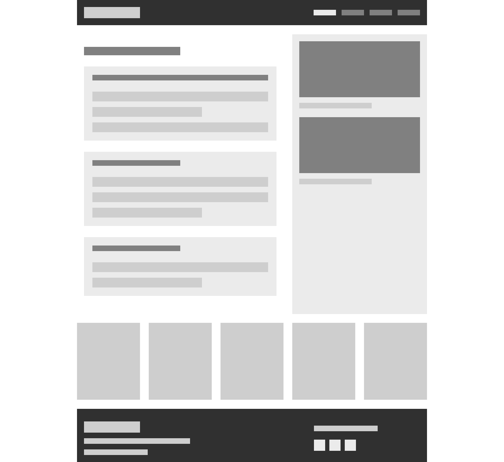

# Project 
Practice for generating wireframes using HTML + CSS. Responsive layout based on containers as placeholders.

## Links

- Live Site URL: [Demo](https://karinaestaba.github.io/wireframe-layout1/)

## Built with

- Semantic HTML5 markup
- Mobile-first workflow
- CSS custom properties
- Flexbox
- CSS Grid

## Author

- Website: [Karina Estaba](https://karina-estaba.gitlab.io/directorio-repositorios/) 🔗

